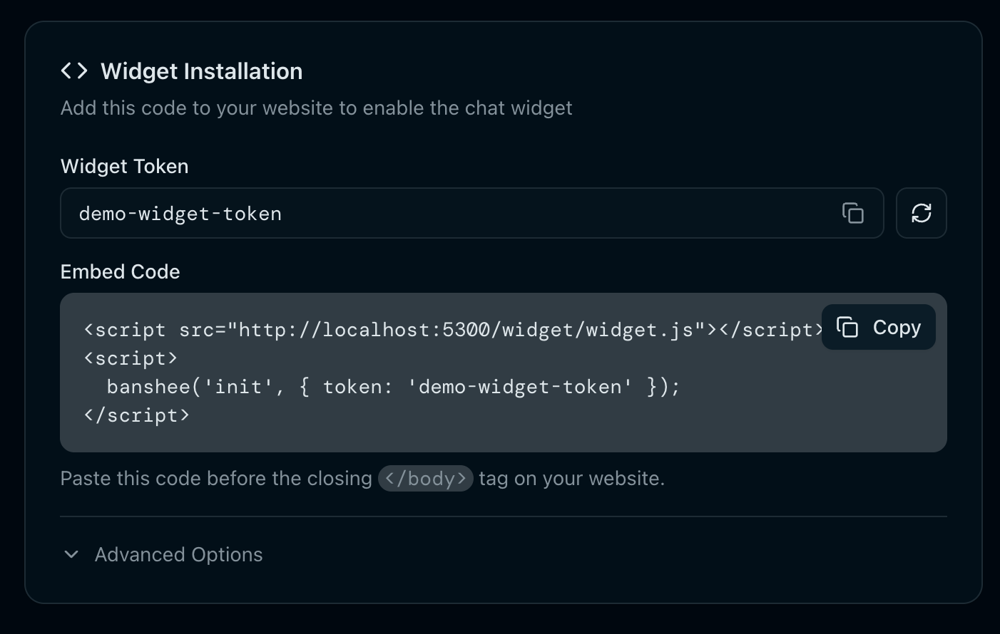

# Banshee Widget

[Banshee](https://banshee.chat) is a customer chat widget for your website.



## Installation

For the most up-to-date installation instructions and your personalized embed code, see the **Widget Setup** section in your [Banshee dashboard](https://app.banshee.chat).

## JavaScript SDK

Once installed, interact with the widget programmatically:

```javascript
// Identify logged-in users
banshee('identify', {
  userId: 'user_123',
  email: 'jane@example.com',
  name: 'Jane Doe',
  metadata: { plan: 'pro' }
});

// Open/close the widget
banshee('open');
banshee('close');
banshee('toggle');

// Listen for events
banshee('on', 'message:received', function(message) {
  console.log('New message:', message);
});

// Reset on logout
banshee('reset');
```

### Events

| Event | Description |
|-------|-------------|
| `open` | Widget opened |
| `close` | Widget closed |
| `message:sent` | Visitor sent a message |
| `message:received` | Agent sent a message |

## API Reference

For custom integrations, the widget uses a REST API.

**Base URL:** `https://app.banshee.chat/api/v1/widget`

All endpoints require a `token` parameter (your widget token from the dashboard).

### Endpoints

| Method | Endpoint | Description |
|--------|----------|-------------|
| POST | `/init` | Initialize session, get config & conversation |
| POST | `/message` | Send a message |
| GET | `/messages` | Get conversation messages |
| POST | `/identify` | Identify visitor, merge anonymous activity |
| GET | `/availability` | Get team online status |
| GET | `/help` | Get help articles |
| GET | `/help/:slug` | Get single help article |
| POST | `/help/:slug/feedback` | Rate article helpfulness |
| POST | `/typing` | Send typing indicator |
| POST | `/heartbeat` | Update visitor presence |

### POST /init

Initialize widget session.

```json
// Request
{
  "token": "YOUR_WIDGET_TOKEN",
  "device_id": "browser-uuid",
  "visitor_id": "existing-visitor-id",
  "page": { "url": "https://example.com/pricing", "title": "Pricing" }
}

// Response
{
  "visitor_id": "vis_abc123",
  "config": {
    "account_name": "Acme Corp",
    "primary_color": "#10b981",
    "greeting": "Hi! How can we help?"
  },
  "availability": {
    "status": "online",
    "agents": [{ "name": "Sarah", "status": "online" }]
  },
  "conversation": { "id": "conv_123", "messages": [...] }
}
```

### POST /message

Send a message from the visitor.

```json
// Request
{
  "token": "YOUR_WIDGET_TOKEN",
  "visitor_id": "vis_abc123",
  "conversation_id": "conv_123",
  "content": "I have a question"
}
```

### POST /identify

Link anonymous visitor to a known user.

```json
// Request
{
  "token": "YOUR_WIDGET_TOKEN",
  "visitor_id": "vis_abc123",
  "user_id": "your_user_id",
  "email": "jane@example.com",
  "name": "Jane Doe",
  "metadata": { "plan": "pro" }
}
```

### GET /availability

```json
// Response
{
  "status": "online",
  "message": "Typically replies in a few minutes",
  "agents": [
    { "name": "Sarah", "status": "online" },
    { "name": "Mike", "status": "away" }
  ]
}
```

## Real-time Updates

The widget uses WebSocket for real-time messaging:

```
wss://app.banshee.chat/cable
```

Events: `new_message`, `typing`, `conversation_status`

## Support

Questions? Contact [support@banshee.chat](mailto:support@banshee.chat) or visit [banshee.chat](https://banshee.chat).
